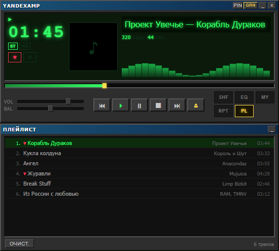

# YandexAmp ⚡

Десктопный плеер в стиле классического **Winamp 2.x** со стримингом из **Яндекс Музыки**.

  

<p align="center">
  
</p>

## Возможности

**Интерфейс**

- 🎨 Классический вид Winamp 2.x: LCD-дисплей, бегущая строка, обложка трека, плейлист
- 🌈 5 скинов: Classic Green, Blue Steel, Amber, Yandex, Blood
- ✨ 5 визуализаторов (клик по дисплею): осциллограф, спектр, LED-матрица, фосфорный осциллограф и неоновые полосы
- 🎛 10-полосный эквалайзер с пресетами (Rock, Pop, Classic, Bass)
- 📌 Кнопка `PIN` — окно поверх всех остальных
- 📐 Окно подстраивается по высоте: свернул плейлист или эквалайзер — плеер стал компактнее

**Музыка**

- 📚 Ваши плейлисты + подборки Яндекса: Плейлист дня, Премьера, Дежавю
- ❤️ «Мне нравится» — вся библиотека лайков целиком
- ⚡ «Моя волна» — бесконечный поток с настройкой по характеру, разнообразию и языку: треки подгружаются на лету, ротор учитывает пропуски и лайки
- 👍 Лайки и дизлайки прямо из плеера, ♥ у любимых треков в плейлисте
- 🔎 Поиск по всей Яндекс Музыке; если трек уже в плейлисте — плеер переходит к нему, а не дублирует
- 🔀 Shuffle с честной историей: «назад» возвращает на реально игравший трек

**Удобство**

- 🔐 Вход через браузер, по логину/паролю или токеном — один раз и надолго
- 💾 После перезапуска на месте: вход, плейлист, текущий трек, громкость, скин и визуализатор

> Для прослушивания нужна активная подписка Яндекс Плюс.

## Установка

### Windows

1. Скачайте `YandexAmp-*-Windows-Setup.exe` из [Releases](../../releases)
2. Запустите и подтвердите запрос прав администратора. По умолчанию плеер ставится в `C:\Program Files\YandexAmp`, папку можно выбрать свою
3. Ярлыки на рабочем столе и в меню «Пуск» создадутся автоматически
4. SmartScreen может предупредить о неизвестном издателе — «Подробнее → Выполнить в любом случае»

### macOS

1. Скачайте `YandexAmp-*-macOS-arm64.dmg` (Apple Silicon) или `YandexAmp-*-macOS-x64.dmg` (Intel) из [Releases](../../releases)
2. Откройте DMG и перетащите YandexAmp в Applications
3. При первом запуске: **правый клик по иконке → Открыть**. Если macOS пишет «приложение повреждено», выполните в терминале:
   ```bash
   xattr -cr /Applications/YandexAmp.app
   ```

Приложение не подписано сертификатами Microsoft и Apple — отсюда предупреждения при первом запуске. Это обычная ситуация для бесплатных проектов с открытым кодом: подписи стоят денег и оформляются на организацию.

## Безопасность и данные

- **Плеер общается только с Яндексом.** Музыка, обложки, плейлисты — всё приходит напрямую с серверов Яндекса по защищённому соединению. Никаких посредников, статистики и рекламы: данные о том, что вы слушаете, никуда больше не уходят
- **Пароль плеер не хранит.** При входе через браузер вы вводите его на обычной странице Яндекса, приложение получает только ключ доступа
- **Ключ доступа остаётся на компьютере** и хранится в зашифрованном виде — средствами самой системы (Windows и macOS шифруют его так, что прочитать можно только из вашей учётной записи на этом же компьютере)
- **Код открыт** — при желании можно посмотреть, что именно делает приложение

## Ограничения

Плеер работает через API Яндекс Музыки, который не предназначен для сторонних приложений. Из этого следуют два момента:

- при изменениях на стороне сервиса что-то может временно перестать работать — потребуется обновление;
- формально такое использование расходится с правилами сервиса, поэтому плеер стоит рассматривать как личный эксперимент, а не как замену официальному приложению.

Проект не связан с Яндексом.

## Для разработчиков

```bash
npm install
npm start
```

Стек: Electron, Web Audio API (эквалайзер и визуализаторы), API Яндекс Музыки. Внешних рантайм-зависимостей нет.
