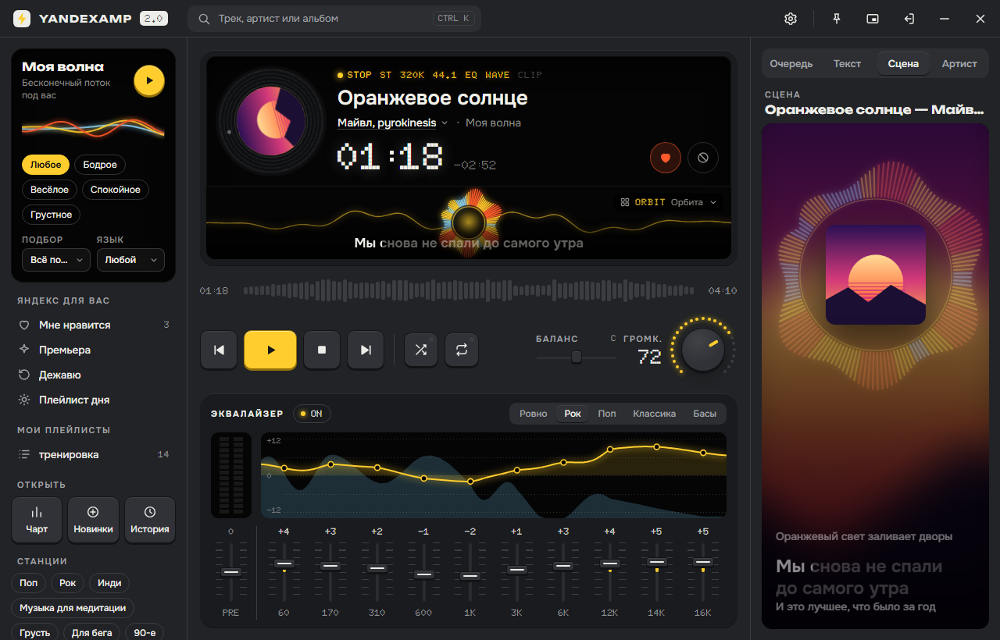
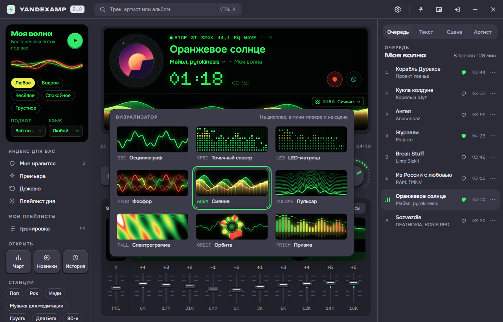
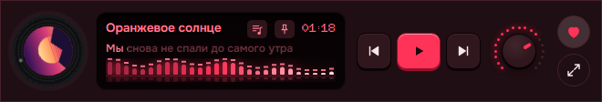
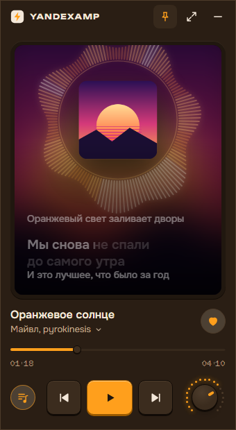
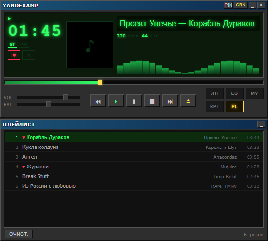

# YandexAmp ⚡

Десктопный плеер для **Яндекс Музыки** в духе железной Hi-Fi деки: дисплей с визуализаторами, 10-полосный эквалайзер, караоке-тексты и клипы треков.

   

<p align="center">
  
</p>

> **Начиная с версии 2.0** YandexAmp — это новый плеер: переписан на Tauri и Rust, с новым дизайном и новыми возможностями. Прежняя версия в стиле Winamp описана [ниже](#версия-1x-electron).

## Что изменилось в 2.0

|  | 1.x | 2.0 |
|---|---|---|
| Движок | Electron (встроенный Chromium) | Tauri 2: Rust + системный WebView |
| Установщик для Windows | 95 МБ | 2 МБ |
| Дизайн | Классический Winamp 2.x | Hi-Fi дека: 5 отделок корпуса, дисплей, аппаратные ручки и фейдеры |
| Визуализаторы | 5 | 9, с живой галереей превью |
| Текст песни | Боковая панель | Синхронное караоке на сцене, на дисплее и в мини-плеере |
| Клипы треков | — | Короткие видео из Яндекс Музыки на отдельной сцене |
| Мини-плеер | Полоска | Полоска или вертикальная карточка со сценой |
| Нестабильная сеть и VPN | Обрыв — ошибка, трек надо запускать заново | Докачка с места обрыва, повторы запросов, следующий трек загружается заранее |
| Хранение входа | Зашифровано системой | Зашифровано и лежит в системном хранилище, интерфейс плеера ключа не видит |

## Возможности

**Дисплей и звук**

- 🎛 10-полосный эквалайзер: кривая строится по реальной частотной характеристике фильтров поверх живого спектра, есть предусиление и пресеты
- ✨ 9 визуализаторов: осциллограф, точечный спектр, LED-матрица, фосфор, «Сияние», «Пульсар», спектрограмма, «Орбита» и «Призма». Выбираются из галереи с живыми превью
- 🎚 Баланс, ручка громкости, стереоиндикатор уровня
- 💿 Вращающаяся пластинка с обложкой, время в стиле точечной матрицы

<p align="center">
  
</p>

**Сцена, тексты и клипы**

- 🎬 Вкладка «Сцена»: клип трека, если он есть в Яндекс Музыке, иначе обложка и визуализатор. «Орбита» рисуется кольцом вокруг обложки
- 🎤 Синхронный текст в режиме караоке: строка заполняется по ходу пения. Та же строка может идти по дисплею и в мини-плеере
- 🏷 Треки с клипами отмечены в списках, на дисплее горит индикатор `CLIP`

**Мини-плееры**

<p align="center">
  
  &nbsp;
  
</p>

- 🗔 Полоска: визуализатор, текст, громкость
- 📱 Карточка: сцена с клипом и текстом, перемотка, громкость
- 📌 У мини-плеера своя кнопка «поверх всех окон», независимая от большого плеера

**Музыка**

- ⚡ «Моя волна» с настройкой по характеру, подбору и языку: треки подгружаются на лету, волна учитывает пропуски и лайки
- 📚 Ваши плейлисты, подборки Яндекса (Плейлист дня, Премьера, Дежавю) и вся библиотека «Мне нравится»
- 📻 Станции по жанрам, настроению, занятиям и эпохам, с фильтром. Чарт, новинки, история
- 🎙 Страница исполнителя; у треков с несколькими исполнителями — список всех
- 📡 Радио по треку, поиск, очередь с перетаскиванием и «поставить следующим»

**Удобство**

- ⚙️ Настройки: отделка корпуса, подсветка дисплея цветом обложки, включение и выключение блоков плеера, вид мини-плеера
- 🎹 Медиаклавиши, значок в трее, системный медиа-оверлей с обложкой
- ⬆ Уведомление о новой версии: кнопка `NEW` в заголовке и блок «О программе» в настройках

> Для прослушивания нужна активная подписка Яндекс Плюс.

## Установка

Скачайте установщик из [Releases](../../releases/latest).

### Windows 10 и 11

1. Скачайте `YandexAmp-*-Windows-Setup.exe` и запустите
2. Если установлена версия 1.x, установщик сам удалит её перед установкой. Войти в аккаунт нужно будет заново
3. SmartScreen может предупредить о неизвестном издателе: «Подробнее → Выполнить в любом случае»

Плеер использует системный компонент WebView2. В Windows 10 и 11 он обычно уже есть; если нет, установщик скачает его сам.

### macOS 11 и новее

1. Скачайте `YandexAmp-*-macOS-universal.dmg`: один файл для Apple Silicon и Intel
2. Откройте DMG и перетащите YandexAmp в Applications (версия 1.x заменится)
3. При первом запуске: **правый клик по иконке → Открыть**. Если macOS пишет «приложение повреждено», выполните в терминале:
   ```bash
   xattr -cr /Applications/YandexAmp.app
   ```

Приложение не подписано сертификатами Microsoft и Apple, отсюда предупреждения при первом запуске.

## Безопасность и данные

- **Плеер общается только с Яндексом** (и с GitHub, чтобы узнать о новой версии). Никаких посредников, статистики и рекламы
- **Пароль плеер не хранит.** При входе через браузер вы вводите его на обычной странице Яндекса, приложение получает только ключ доступа
- **Ключ доступа живёт только в Rust-части приложения.** Интерфейс его никогда не получает: все запросы к Яндексу делает ядро, поэтому даже вредоносный текст в названии трека не смог бы ключ украсть
- **Ключ хранится зашифрованным** (AES-256-GCM) в системном хранилище: «Диспетчере учётных данных» Windows или «Связке ключей» macOS. Расшифровать его можно только на этом компьютере и в этой учётной записи
- **Выход из аккаунта** отзывает ключ у Яндекса и стирает его с компьютера
- **Код открыт**: можно посмотреть, что именно делает приложение

## Ограничения

Плеер работает через API Яндекс Музыки, который не предназначен для сторонних приложений. Из этого следуют два момента:

- при изменениях на стороне сервиса что-то может временно перестать работать, и потребуется обновление;
- формально такое использование расходится с правилами сервиса, поэтому плеер стоит рассматривать как личный эксперимент, а не как замену официальному приложению.

Клипы есть не у всех треков: Яндекс делает их лишь для части каталога.

Проект не связан с Яндексом.

## Версия 1.x (Electron)

<p align="center">
  
</p>

Первая версия плеера — классический **Winamp 2.x** на Electron: LCD-дисплей с бегущей строкой, 5 скинов, 5 визуализаторов, эквалайзер, перетаскиваемые панели и мини-режим. Все музыкальные возможности (Моя волна, плейлисты, станции, тексты, исполнители) в 2.0 сохранились.

Версия 1.x больше не развивается. Последний выпуск — [v1.3.0](../../releases/tag/v1.3.0). Если она у вас установлена, плеер покажет кнопку `NEW` со ссылкой на 2.0.

## Для разработчиков

Нужны Node.js 22 и Rust (stable).

```bash
npm install
npm run tauri:dev     # запуск с горячей перезагрузкой интерфейса
npm run tauri:build   # установщик для текущей системы
```

Устройство:

- `src-tauri/` — ядро на Rust: клиент API Яндекс Музыки, шифрованное хранилище входа, аудиопрокси `yamp://` с докачкой (нужен, чтобы эквалайзер и визуализаторы работали через Web Audio)
- `ui/` — интерфейс на чистых HTML, CSS и JS без сборщика; общается с ядром только через команды Tauri
- `src/`, `renderer/`, `main.js` — прежняя версия 1.x на Electron

Релиз: поднимите `version` в `src-tauri/tauri.conf.json` и `src-tauri/Cargo.toml`, затем запушьте аннотированный тег `vX.Y.Z`. Текст аннотации станет описанием релиза. GitHub Actions соберёт установщики для Windows и macOS и опубликует их.
